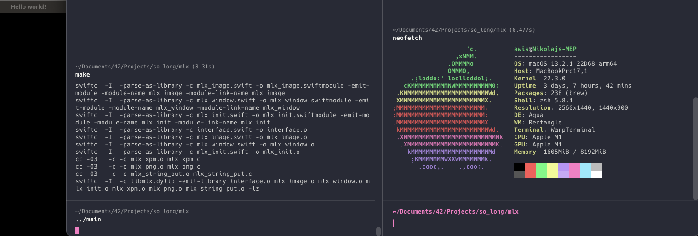

# MiniLibX Fixed for macOS

Hey there! This is a fixed version of the MiniLibX library for macOS users. We've patched up some issues in the Swift code and made it more compatible with different systems.

## What's Fixed?

I've addressed a few warnings and errors in the Swift code, including:

- Properly initializing `UnsafeMutableRawPointer`
- Using `withUnsafeMutableBytes` instead of the temporary pointer
- Fixed an issue with dynamic library loading at runtime

These fixes make the library more compatible with different macOS systems and improve overall stability.

## How to Use

1. Clone this repo to your local machine
2. Compile the library using the provided Makefile
3. ???????
4. Profit

Feel free to report any issues or contribute to the project! Happy coding! 😊
